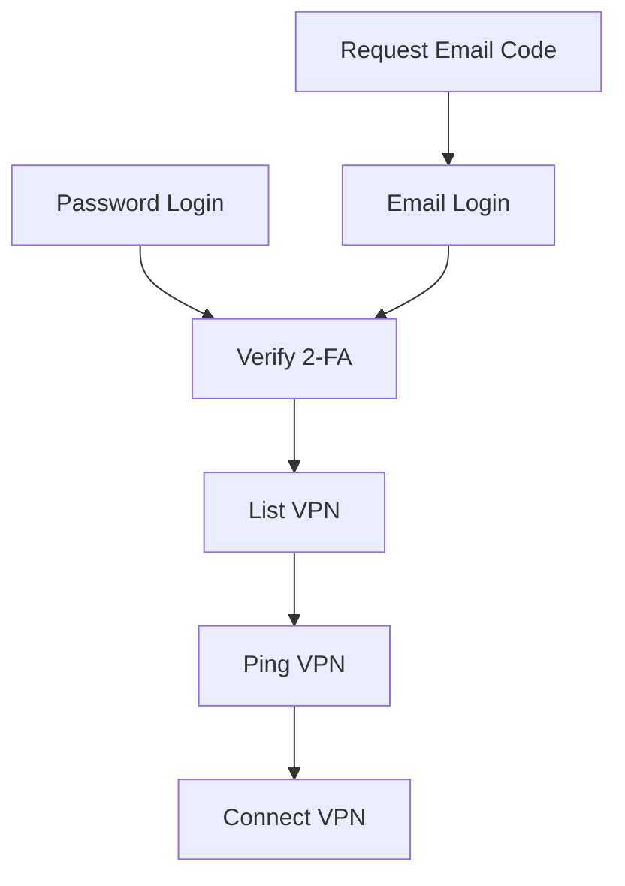
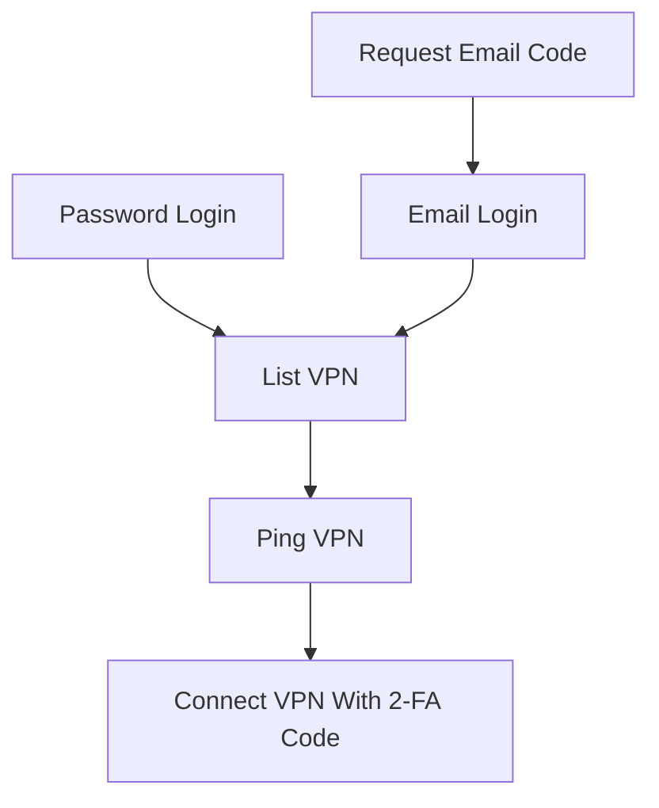

# feilian-cli / corplink-rs

面向飞连（Feilian / CorpLink）企业租户的非官方跨平台 CLI。输入企业标识、用官方飞连手机 App 扫描二维码并确认 VPN 推送，即可建立企业网络连接；也可以暴露本地 SOCKS5 节点，让 Clash 只把指定企业域名/IP 交给飞连。

An unofficial cross-platform CLI for Feilian/CorpLink enterprise tenants, with QR login, mobile push approval, system VPN/TUN, and a userspace SOCKS5 endpoint for Clash split routing.

> 本项目与飞连官方无隶属关系，也未获得官方背书。它不会绕过企业认证、安全策略或访问控制。兼容性取决于企业租户的飞连版本和管理员策略。
>
> This project is not affiliated with or endorsed by Feilian. It does not bypass enterprise authentication or policy enforcement. Compatibility depends on the tenant and its administrator settings.

## 亮点 / Highlights

- 支持采用飞连/CorpLink 的第三方企业租户，通过企业标识自动发现租户服务，不写死任何公司信息。
- 默认使用二维码登录，无需在终端输入企业密码。
- 支持飞连手机 App 的 VPN Push MFA；手机点击确认后继续连接。
- 支持系统 TUN、服务端路由、split/full 模式，以及额外域名和 CIDR 控制。
- 支持纯用户态 SOCKS5，适合 Clash 按企业域名/IP 精确分流；不创建系统 TUN、路由或 DNS。
- 一个 npm 主包覆盖 macOS arm64/x64、Linux arm64/x64 和 Windows x64，只安装当前平台二进制。
- 首次运行交互生成 `~/feilian-cli.config.json`；后续正常启动时发现新版本会自动通过 npm 安装，并直接启动新版。

- Works with third-party Feilian/CorpLink enterprise tenants by discovering the service from the tenant identifier; no organization is hard-coded.
- QR login by default, without typing the enterprise password into the terminal.
- Feilian mobile push MFA for VPN approval.
- System TUN, server-provided routes, split/full modes, and additional domain/CIDR controls.
- Userspace SOCKS5 for precise Clash routing without changing system interfaces, routes, or DNS.
- Native npm packages for macOS, Linux, and Windows, with only the current platform binary installed.
- Interactive first-run configuration, followed by automatic npm updates that start the newly installed CLI.

## npm 安装 / Install from npm

需要 Node.js 16 或更高版本。

Node.js 16 or newer is required.

```bash
npm install --global feilian-cli@latest
feilian-cli
```

首次运行会询问企业标识和可选账号/邮箱，生成本地配置，然后显示二维码。使用官方飞连 App 扫码确认；如果企业要求 VPN 二次验证，再在手机上确认推送。TUN 模式出现的 `Password:` 是本机管理员密码，不是企业密码。

On first run, enter the tenant identifier and optional account/email, scan the QR code with the official Feilian app, and approve the VPN push if required. A `Password:` prompt in TUN mode asks for the local administrator password, not the enterprise password.

```bash
feilian-cli --version
feilian-cli --check-update
feilian-cli /path/to/config.json
```

正常启动时若发现新版本，npm 启动器会自动安装并直接启动新版；检查或安装失败不会阻止当前版本运行。`--check-update` 只报告版本状态，不执行安装。

On a normal start, the npm launcher installs an available update and starts the newly installed CLI. Check or installation failures do not prevent the current version from running. `--check-update` only reports version status and never installs anything.

## Clash 分流 / Clash split routing

在 `~/feilian-cli.config.json` 中启用用户态 SOCKS5：

Enable userspace SOCKS5 in `~/feilian-cli.config.json`:

```json
{
  "company_name": "your-enterprise-id",
  "username": "you@example.com",
  "platform": "feilian_qr",
  "vpn_mfa_type": "push",
  "socks5_listen": "127.0.0.1:11080",
  "auto_setup_routes": false,
  "use_vpn_dns": false
}
```

Clash 示例；请把占位域名和网段换成企业管理员提供的实际范围，并把这些规则放在普通代理规则之前：

Clash example; replace the placeholders with enterprise-managed domains and CIDRs, and keep these rules above general proxy rules:

```yaml
proxies:
  - name: Feilian-Enterprise
    type: socks5
    server: 127.0.0.1
    port: 11080
    udp: false

rules:
  - DOMAIN-SUFFIX,corp.example,Feilian-Enterprise
  - DOMAIN,portal.corp.example,Feilian-Enterprise
  - IP-CIDR,10.20.0.0/16,Feilian-Enterprise,no-resolve
  - MATCH,Your-Existing-Policy
```

不要把本地 SOCKS5 地址、飞连企业服务端或 VPN 网关再次转发到 `Feilian-Enterprise`，否则会形成环路。企业规则也不应配置公网 fallback；飞连断开时应让企业请求直接失败，避免误发到公网。

Do not route the local SOCKS5 endpoint, tenant service, or VPN gateway back through `Feilian-Enterprise`, which would create a loop. Avoid public fallbacks for enterprise rules so private requests fail closed when Feilian disconnects.

## 致谢 / Acknowledgements

本项目 fork 自 [PinkD/corplink-rs](https://github.com/PinkD/corplink-rs)。感谢 PinkD、上游维护者与所有贡献者提供 Rust 客户端、WireGuard、路由和跨平台基础。本 fork 在此基础上增加 npm 分平台发布、交互式企业配置、飞连二维码登录、手机 Push MFA，以及面向 Clash 的 SOCKS5 分流流程。

This project is forked from [PinkD/corplink-rs](https://github.com/PinkD/corplink-rs). Many thanks to PinkD, the upstream maintainers, and every contributor for the Rust client, WireGuard, routing, and cross-platform foundation. This fork adds per-platform npm distribution, interactive enterprise setup, Feilian QR login, mobile push MFA, and a Clash-oriented SOCKS5 workflow.

# 安装

## ArchLinux

下载 [release](https://github.com/PinkD/corplink-rs/releases) 中的安装包，并安装

```bash
pacman -U corplink-rs-4.1-1-x86_64.pkg.tar.zst
```

> 欢迎贡献其它包管理器的打包脚本

## 手动编译

### linux/macos

```bash
git clone https://github.com/PinkD/corplink-rs --depth 1
cd corplink-rs
# build libwg
cd libwg
./build.sh
# if you are using Windows, you can clone and build libwg maunally
# ref: wireguard-go/Makefile:libwg

cargo build --release
# install corplink-rs to your PATH
mv target/release/corplink-rs /usr/bin/
```

### windows

**前提**: 需要 Go (≥1.22)、GCC (MinGW-w64)、make、Rust (GNU 工具链)。

安装工具链后，在 **PowerShell** 中执行：

```powershell
# 1. 构建 libwg（生成 libwg.a + libwg.h）
cd libwg
.\build.ps1

# 2. 构建 Rust 项目
cd ..
rustup toolchain install stable-gnu
rustup default stable-x86_64-pc-windows-gnu
cargo build --release
```

> 编译的 `build.ps1` 会调用 `make libwg`，该目标会以 `CGO_ENABLED=1` 编译 Go 代码。
> MinGW GCC 需要在 PATH 中，且 make 需要支持 bash 风格环境变量语法。
> 也可在 MSYS2 UCRT64 环境中执行 `./build.sh`（同样需要 Go + GCC）。

# 用法

> **该程序需要 root 权限来启动 `wg-go` (windows 上需要管理员权限)**

```bash
# direct
corplink-rs config.json
# systemd
# config is /etc/corplink/config.json
systemctl start corplink-rs.service
# auto start
systemctl enable corplink-rs.service

# systemd with custom config
# config is /etc/corplink/test.json
# NOTE: cookies.json is reserved by cookie storage
systemctl start corplink-rs@test.service
```

## windows 使用说明

### 快速开始（推荐使用预编译版本）

1. 从 [Releases](https://github.com/PinkD/corplink-rs/releases) 下载 `corplink-rs-*-windows.zip`
2. 解压到任意目录
3. 运行 `setup.ps1` 自动获取 `wintun.dll`：

```powershell
powershell -ExecutionPolicy Bypass -File setup.ps1
```

4. 编辑 `config.json`，填入公司代码和登录信息（见下方配置文件实例）
5. 以**管理员身份**打开 PowerShell，运行：

```powershell
.\corplink-rs.exe config.json

# 调试模式
$env:RUST_LOG="debug"; .\corplink-rs.exe config.json
```

### wintun.dll 说明

`corplink-rs` 依赖 [Wintun][6] 虚拟网卡驱动来创建 WireGuard 隧道。由于 Wintun 的许可证要求用户从[官网][6]直接获取，我们无法在 release 包中附带该文件。

`setup.ps1` 脚本会自动从 `wintun.net` 下载并解压 `amd64` 版本的 `wintun.dll` 到当前目录。

手动获取：访问 [wintun.net][6]，下载 zip 包，将 `bin/amd64/wintun.dll` 复制到 `corplink-rs.exe` 所在目录。

### 管理员权限

程序需要管理员权限，原因：
- `wg-go` 需要创建 TUN 虚拟网卡
- 配置系统路由表（自动添加 VPN 路由）

如果运行时提示 `please run as administrator`，右键 PowerShell 选择"以管理员身份运行"。

### 常见问题

- **wintun.dll 找不到**：运行 `setup.ps1` 或手动下载放入同目录
- **配置文件 JSON 不支持注释**：示例中的 `// comment` 需要删除
- **路由未生效**：检查是否以管理员运行，关闭其他 VPN 软件避免路由冲突

## macos 特殊说明

macos 要求 tun 设备的名称满足正则表达式 `utun[0-9]*`。npm CLI 新建的配置会自动使用 `utun12345`；旧配置如有需要，可将 `interface_name` 改为符合正则的名字。
另外， `utun` 后的数字类型应该是 `int16` ，如果大于 `32767` 会报错 `Failed to create TUN device: invalid argument` 。具体参考 [#46](https://github.com/PinkD/corplink-rs/issues/46)

## log level 配置

本项目使用 [env_logger](https://docs.rs/env_logger/latest/env_logger/) 作为 log 库，修改 log level 需要使用环境变量，示例：

```bash
RUST_LOG=debug ./corplink-rs config.json
```

# 配置文件实例

最小配置

```json
{
  "company_name": "company code name",
  "username": "your_name"
}
```

推荐配置(自用配置)

```json
{
  "company_name": "company code name",
  "username": "your_name",
  "password": "your_pass",
  "platform": "ldap"
}
```

完整配置

```json
{
  "company_name": "company code name",
  "username": "your_name",
  // support sha256sum hashed pass if you don't use ldap, will ask email for code if not provided
  "password": "your_pass",
  // default is feilian, can be feilian/ldap/lark(aka feishu)/OIDC
  // dingtalk/aad/weixin is not supported yet
  "platform": "ldap",
  "code": "totp code",
  // default is DollarOS(not CentOS)
  "device_name": "any string to describe your device",
  "device_id": "md5 of device_name or any string with same format",
  "public_key": "wg public key, can be generated from private key",
  "private_key": "wg private key",
  "server": "server link",
  // enable wg-go log to debug uapi problems
  "debug_wg": true,
  // will use corplink as interface name
  "interface_name": "corplink",
  // will use the specified server to connect, for example 'HK-1'
  // name from server list
  "vpn_server_name": "hk",
  // latency/default
  // latency: choose the server with the lowest latency
  // default: choose the first available server
  "vpn_select_strategy": "latency",
  // use vpn dns (macOS: networksetup; Linux: rename /etc/resolv.conf aside
  //   and write a new one with the VPN-provided nameserver)
  // NOTE: if process doesn't exit gracefully, your dns may not be restored
  "use_vpn_dns": false,
  // optional: filename for the Linux backup of /etc/resolv.conf.
  // Default "resolv.conf.corplink", always placed next to /etc/resolv.conf.
  // macOS ignores this field.
  "dns_backup_filename": null,
  // automatically setup system routes (default: true)
  // set to false if you want to manually configure routes
  "auto_setup_routes": true,
  // route mode: "split" (default) or "full"
  // - split: use intranet routes from server (same as official split mode)
  // - full:  use full-tunnel routes from server
  //          often combined with "auto_setup_routes": false in container/gateway setups
  "route_mode": "split",
  // optional CIDRs added to the server-provided routes before filtering. unlike
  // vpn_allowed_routes, this can introduce networks not covered by server routes.
  // the combined routes are still subject to the allowlist and denylist below.
  "vpn_additional_routes": ["20.205.243.160/28"],
  // optional exact hostnames resolved on every VPN connection/reconnection.
  // each IPv4 result is appended as a /32 route; IPv6 results are appended as
  // /128 routes only when the server assigns an IPv6 tunnel address.
  "vpn_additional_domains": ["github.com", "api.github.com"],
  // optional strict CIDR whitelist. each entry is intersected with the routes
  // returned by the server plus the additional routes above. an empty list allows
  // no routes; missing/null preserves all routes. when both lists are set,
  // vpn_disallowed_routes is subtracted after this whitelist. the allowlist must
  // also cover every additional route that should be retained, so leave it unset
  // when using domain routes whose resolved addresses are not known in advance.
  // "vpn_allowed_routes": ["192.168.2.0/24"],
  // optional: list of CIDRs to carve out of AllowedIPs (and system routes).
  // applied as CIDR subtraction: each entry is subtracted from every route
  // returned by the server, so listing a smaller range like "10.68.0.0/16"
  // still punches a hole even when the server returns a supernet like
  // "0.0.0.0/0" (full-tunnel). useful for keeping local LAN traffic off the
  // VPN, and for excluding the VPN peer endpoint IP to avoid a routing loop
  // that would otherwise black-hole all traffic.
  "vpn_disallowed_routes": ["192.168.1.0/24"],
  // optional: run entirely in userspace (gVisor netstack) and expose a SOCKS5
  // proxy at this address instead of creating a kernel TUN device. No system
  // interface, routes, DNS changes or root privileges are required.
  // supports TCP CONNECT and UDP ASSOCIATE; hostnames are resolved in-tunnel.
  "socks5_listen": "0.0.0.0:1080",
  // optional: require SOCKS5 username/password auth (RFC 1929) on the proxy.
  // when socks5_username is empty/unset, the proxy accepts connections with no auth.
  "socks5_username": "user",
  "socks5_password": "pass",
  // optional: force the WireGuard transport ("udp" or "tcp") instead of the
  // server-advertised protocol_mode. some protocol_mode=1 (tcp) gateways also accept
  // WireGuard over UDP -- the server even ships a protocol_detect_config (udp<->tcp switch
  // thresholds) for them in /api/vpn/list. since WireGuard-over-TCP can collapse to a few
  // KB/s on a lossy uplink (TCP-over-TCP), forcing "udp" can be far faster there.
  // leave unset to follow the server's protocol_mode (1 => tcp, otherwise udp).
  "force_protocol": "udp"
}
```

## SOCKS5 / netstack 模式

设置 `socks5_listen` 后，corplink-rs 不再创建内核 TUN 网卡，而是用 [wg-go][2] 的 gVisor netstack 在用户态跑 WireGuard，并在该地址上暴露一个 SOCKS5 代理：

- **无需 root / 不改系统路由和 DNS / 不建网卡**，适合容器、无权限环境或只想给单个应用走 VPN 的场景
- 支持 TCP `CONNECT` 和 UDP `ASSOCIATE`，域名在隧道内解析（用 `--socks5-hostname` 让客户端把 DNS 也交给代理）
- 可选用户名/密码认证（RFC 1929）：设置 `socks5_username`（及 `socks5_password`）即开启；留空则免认证

```sh
# 例：通过代理访问内网
curl --socks5-hostname user:pass@127.0.0.1:1080 https://intranet.example.com/
```

此模式下 `interface_name`、`use_vpn_dns`、`auto_setup_routes` 等与系统网卡/路由相关的设置不生效。

# 原理和分析

[飞连][1] 是基于 [wg-go][2] 魔改的企业级 VPN 产品

## 配置原理

魔改了配置的方式，加了鉴权

猜测是：
- 动态管理 peer
- 客户端通过验证后，使用 public key 来请求连接，然后服务端就将客户端的 key 加到 peer 库里，然后将配置返回给客户端，等待客户端连接
    - wg 是支持同一个接口上连多个 peer ，所以这样是 OK 的
- 定时将不活跃的客户端清理，释放分配的 IP
- ...

因此，我们只需要生成 wg 的 key ，然后去找服务端拿配置，然后写到 wg 配置里，启动 wg ，就能连上服务端了

### 后续改动

2.0.9 版本(或者更早)新增了 `protocol_version` 字段，需要使用魔改后的 [wg-corplink][5] 才能连接

## 请求流程


### Linux



### Android



## otp 实现

飞连的 otp 是使用的标准的 [totp][1] ，在 ua 为 Android 时，会在登录时返回 totp 的 token ，然后使用 totp 算法就能生成出当前时间的验证码了，然后在获取连接信息时传输该验证码，就不需要单独验证验证码了

# TODO

- [ ] 使用 [Tauri][7] 实现界面(~~或许大概可能永远不会有~~)
  - 参考实现：https://github.com/huangzheng2016/ecorplink
- [x] 实现 TCP 版的 wg 协议
- [x] 为不同配置生成不同的 `cookies.json`
- [x] windows/mac 实现
- [x] 自动使用从服务器返回的请求中的时间戳同步时间
- [x] 自动生成 wg key
- [x] 修复服务端异常断开连接后客户端不会退出的问题

# Changelog

- 1.0.2
  - automatically install npm updates before starting the native CLI
  - start the newly installed CLI after a successful update and keep the current version running if installation fails
  - keep `--check-update` as a read-only version check
- 1.0.1
  - route primary and backup VPN DNS servers through the WireGuard peer in SOCKS5/netstack mode
- 1.0.0
  - publish `feilian-cli` through npm with native per-platform packages
  - add interactive enterprise setup and user-home configuration
  - add Feilian QR login and mobile Push MFA for VPN connections
  - add official-flow session initialization and persistent WebSocket confirmation handling
  - document Clash split routing through the userspace SOCKS5 endpoint
- 0.5.5
  - add more route configs(@yanickxia @zier-one @kfxhjz @ZeppLu)
  - support protocol override config(@n-WN)
  - usermode proxy with socks5(@wilinz)
  - minor fix(@Ben8368 @huangzheng2016)
- 0.5.4
  - fix memory leak in unsafe code
  - refactor error handling with `anyhow`
  - fix default log level
  - add ci for push event(@yanyongyu)
- 0.5.3
  - remove keep-alive api call
- 0.5.2
  - add ipv6 support(@hexchain @ManiaciaChao)
- 0.5.1
  - support using dns from server for macos(@fanwenlin)
  - fix high cpu usage
- 0.5.0
  - add tcp support for wg-go
- 0.4.4
  - add macos release(by @overvenus)
  - fix single ip route(by @simpleapples)
  - add qr code suuport for feishu login(@simpleapples)
- 0.4.3
  - support corplink 2.2.x(by @jixiuf)
- 0.4.2
  - add OIDC platform support(by @Jinxuyang)
- 0.4.1
  - fix Windows device up
  - fix undefined behavior for c str
- 0.4.0
  - embed wg-go with cgo
- 0.3.6
  - fix wg-corplink not exit(by @LionheartLann)
  - fix session is expired(by @XYenon)
- 0.3.5
  - fix empty login method list
  - fix write long data to uapi(by @nolouch)
  - add vpn server name option(by @nolouch)
- 0.3.4
  - fix cookie out of date
- 0.3.3
  - add feishu tps login support
  - upgrade dependency
- 0.3.2
  - separate `cookies.json`
  - add debug flag for wg-go
- 0.3.1
  - fix mac support(on [wg-corplink][5])
- 0.3.0
  - add windows/mac support
- 0.2.3
  - fix empty `protocol_version`
  - add privilege check
- 0.2.2
  - fix wg-corplink not exit if corplink-rs exit accidently
- 0.2.1
  - use modified wireguard-go
    - don't generate config anymore
  - remove `conf_name/conf_dir` and add `interface_name/wg_binary` in config
- 0.1.4
  - get company name from company code automatically
  - support ldap
  - check and skip tcp wg server
  - optimize config
- 0.1.3
  - disconnect if wireguard handshake timeout
- 0.1.2
  - support time correction for totp
- 0.1.1
  - support generate wg key
- 0.1.0
  - first version

# 参考链接

- [wg-go][2]
- [totp][3]
- [python 版本][4]
- [wg-corplink][5]
- [wintun][6]
- [Tauri][7]

# License

```license
 Copyright (C) 2022-2026  PinkD
 Other contributors: https://github.com/PinkD/corplink-rs/graphs/contributors

    This program is free software; you can redistribute it and/or
    modify it under the terms of the GNU General Public License
    as published by the Free Software Foundation; either version 2
    of the License, or (at your option) any later version.

    This program is distributed in the hope that it will be useful,
    but WITHOUT ANY WARRANTY; without even the implied warranty of
    MERCHANTABILITY or FITNESS FOR A PARTICULAR PURPOSE.  See the
    GNU General Public License for more details.

    You should have received a copy of the GNU General Public License
    along with this program; if not, write to the Free Software
    Foundation, Inc., 51 Franklin Street, Fifth Floor, Boston, MA  02110-1301, USA.
```


[1]: https://www.volcengine.com/product/vecorplink
[2]: https://github.com/WireGuard/wireguard-go
[3]: https://en.wikipedia.org/wiki/Time-based_one-time_password
[4]: https://github.com/PinkD/corplink
[5]: https://github.com/PinkD/wireguard-go
[6]: https://www.wintun.net/
[7]: https://github.com/tauri-apps/tauri
